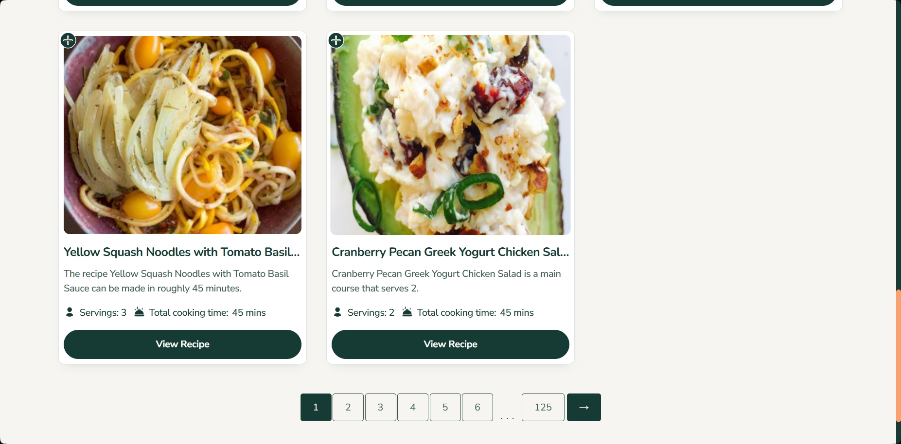
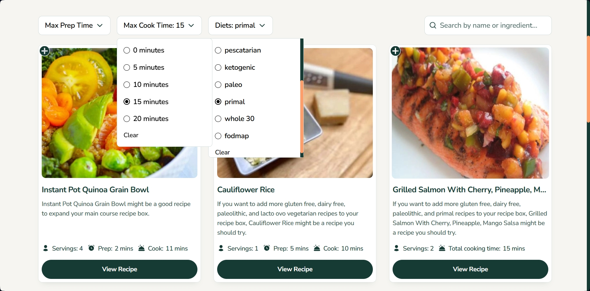

# Frontend Mentor - Recipe finder website solution

This is a solution to the [Recipe finder website challenge on Frontend Mentor](https://www.frontendmentor.io/challenges/recipe-finder-website--Ui-TZTPxN). Frontend Mentor challenges help you improve your coding skills by building realistic projects.

## Table of contents

- [Overview](#overview)
  - [The challenge](#the-challenge)
  - [Screenshot](#screenshot)
  - [Links](#links)
- [My process](#my-process)
  - [Built with](#built-with)
  - [What I learned](#what-i-learned)
  - [Continued development](#continued-development)
  - [Useful resources](#useful-resources)
- [Author](#author)

## Overview

### The challenge

Users should be able to:

- View the home, about, recipes index, and recipe detail pages
- Search for recipes by name or ingredient
- Filter recipes by max prep or cook time
- View the optimal layout for the interface depending on their device's screen size
- See hover and focus states for all interactive elements on the page

### Screenshots




### Links

- Solution URL: [Github](https://github.com/DmytroVoitovych/healthy-recipe-finder)
- Live Site URL: [Live page](https://healthy-recipe-finder.duckdns.org/)

## My process

### Built with

- Semantic HTML5 markup
- CSS custom properties
- Flexbox
- CSS Grid
- Mobile-first workflow
- [React](https://reactjs.org/) - JS library
- [Next.js](https://nextjs.org/) - React framework
- [Oracle Cloud](https://cloud.oracle.com/) - For deployment and place frontend and backend in same place
- [Duck DNS](https://www.duckdns.org/) - For free domain
- [NGINX-QUIC](https://nginx.org/en/docs/quic.html) - For support modern HTTP/3 protocol
- [FOOD-API](https://spoonacular.com/food-api) - To ensure real data recipe
- [My pagination npm](https://www.npmjs.com/package/simple-pagination-hook) - To make pagination fast and easy

# 🥗 Healthy Recipe Finder


> A production-grade Next.js application optimized to run on a **1 GB Oracle Cloud VM** using **HTTP/3**, **in-memory caching**, and **modern browser APIs** — built entirely as a personal learning challenge.

---

## ⚙️ Tech Overview

| Category        | Stack                                             |
| --------------- | ------------------------------------------------- |
| **Frontend**    | Next.js 15.5 (App Router) + React 19 + TypeScript |
| **Runtime**     | Node.js (systemd-managed)                         |
| **Server**      | Nginx 1.27.2 (HTTP/3 + QUIC)                      |
| **Hosting**     | Oracle Cloud Free Tier (1 GB RAM, 1 vCPU)         |
| **CI/CD**       | GitHub Actions → SSH deploy → systemd restart     |
| **Data Source** | Spoonacular API (cached server-side)              |

---

## ⚡ Performance & Infrastructure

- **Protocol:** HTTP/3 (QUIC) with 0-RTT connection resumption
- **Caching:** Aggressive in-memory cache (1000 + recipes)
- **Response Time:** 20 – 47 ms for cached responses
- **Memory Usage:** ≈ 400 MB stable footprint
- **Availability:** 99.9 % uptime on 1 GB RAM
- **Compression:** Gzip + optional Brotli via Nginx

### 🧠 Why This Stack

- 🧱 **Minimal footprint:** No DB, no Redis — single VM only
- ⚙️ **Optimized pipeline:** API → preload → memory map → client fetch
- 🚀 **Modern protocol:** HTTP/3 QUIC removes TCP bottlenecks
- 🔒 **Secure & fast:** TLS 1.3 + zero-downtime CI/CD deploys

---

## 🧱 Architecture

```text
Oracle Cloud VM (Ubuntu 22.04)
        ↓
Nginx 1.27.2 (HTTP/3 reverse proxy)
        ↓
Next.js Server (via systemd)
        ↓
preloadRecipes.ts (fetch + cache)
        ↓
In-memory Map cache
        ↓
Midlware
        ↓
API routes (/api/recipes)
        ↓
React Server Components
        ↓
Client UI
```

- **Server-side cache:** Warm preload on startup + daily revalidation
- **API gateway:** Stale-while-revalidate for low latency
- **No external deps:** Ideal for constrained environments

---

## 🧭 Frontend Highlights

### 🎨 Pure CSS Innovation

- Detects a _single active item_ using `:has()` + `nth-child(1 of …)` + `nth-last-child(1 of …)`
- Firefox-safe fallback via `@supports (-moz-user-select: none)`
- Prevents layout shift from scrollbar using negative margin trick instead of `scrollbar-gutter`

### 🧩 Modern Browser APIs

- View Transitions API for page animations
- Popover API for dropdown menus + custom polyfill hook for Firefox
- Art-direction responsive images via `<ArtDirectionImage />`

### ♿ Accessibility & UX

- All interactive elements use ARIA (`aria-pressed`, `aria-live`)
- Pagination synced with URL via `useSearchParams()`
- Smooth scroll restoration on page change

---

## ❤️ Favorites System

Lightweight client-side store synchronized across tabs:

- Uses `localStorage` + custom `localstorage-signal` event for instant sync
- Listens for native `storage` events between tabs
- Reactively updates navigation + favorites page (no global state lib)
- Accessible controls (`aria-pressed`, keyboard focus)

---

## 📦 Open Source Contribution — `useSimplePagination`

A custom pure function published on npm that generates adaptive pagination ranges for any dataset.

```ts
useSimplePagination(currentPage, totalPages, visibleButtons, shift?)
// → [1, 5, 6, 7, 125]
```

### ✨ Features

- Keeps the current page centered
- Always includes first and last page
- Supports optional window shift
- Auto-adjusts for small visible ranges (warns in dev)
- Fully typed (TypeScript) and tested with Jest

**NPM:** [`use-simple-pagination`](https://www.npmjs.com/package/simple-pagination-hook)

> This hook was extracted from the _Healthy Recipe Finder_ project and is now used independently in other applications.

---

## 🧪 Testing

- **Jest + React Testing Library** for unit & integration tests
- Coverage on pagination, dropdowns, caching and store logic
- Focus on behavior, not snapshots

---

## 🚀 Deployment Pipeline

1. Push to `main` → GitHub Action trigger
2. SSH to Oracle VM
3. Pull latest code
4. Build (`npm run build`)
5. Restart via `systemctl restart nextjs`
6. Zero downtime deployment (monitored by healthcheck)

---

## 🧰 Systemd Service

```ini
[Unit]
Description=Next.js Server
After=network.target

[Service]
User=ubuntu
WorkingDirectory=/home/ubuntu/app
ExecStart=/usr/bin/npm run start -- --hostname 0.0.0.0 --port 3000
Environment=NODE_ENV=production
Environment=NODE_OPTIONS=--max-old-space-size=700
Restart=always
RestartSec=10
MemoryLimit=800M
MemoryMax=900M

[Install]
WantedBy=multi-user.target
```

---

## 📈 Results

| Metric            | Result          |
| ----------------- | --------------- |
| First Response    | 176 ms (cold)   |
| Cached Response   | 20 – 47 ms      |
| Recipes Preloaded | 1000 +          |
| Memory Use        | ≈ 400 MB / 1 GB |
| Uptime            | > 99.9 %        |
| Deployment Time   | < 20 s          |

---

## 🔬 Lessons Learned

- Near-enterprise performance is possible on free-tier VMs
- Modern APIs (`:has`, Popover, View Transitions) are production-ready
- Pure CSS + small custom hooks > heavy libraries
- Constraints lead to cleaner architecture

---

### What I learned

Actually, I learned a lot of things, from implementing the modern Popover API in dropdown menus to starting a virtual machine on Oracle Cloud. Despite this being a simple project, I implemented mini Redis caching that allows delivering data super fast to users. Also, I deployed my own npm package for pagination that is one of the fastest nowadays. I solved scroll shift by using modern CSS for better performance. I invented a new CSS way to detect exactly one active element among other inactive ones without JS. I reached maximum SEO for all pages on the site. I found out about a visual-transitions bug with overlapping and tackled it by changing the design and putting a switcher.

In addition, I created a lot of custom hooks, where one of them works like a polyfill for Firefox since I implemented dropdown menus with radio buttons using the Popover API.

But everything that I mentioned is not the most important thing. The most important thing is that I overcame Spoonacular API limits by hard caching on the server, and using Oracle Cloud, I ran a virtual machine with Ubuntu where I launched my project. That was really challenging since it was my first time using Oracle Cloud, and I spent 3 days to finally force it to work. Maybe I'm one of the few developers who deploy Next.js projects on Oracle Cloud, especially using the free tier that provides only 1GB RAM and 1 CPU.

See below my css trick for detecting single active el among inactive:

```css
@media (min-width: $md) {
  &
    li:has([aria-pressed="true"]):nth-child(
      1 of li:has([aria-pressed="true"])
    ):nth-last-child(1 of li:has([aria-pressed="true"])) {
    width: fit-content;
    max-width: calc(100vw / 2);
    place-self: center;

    @media (min-width: $lg) {
      max-width: calc(100vw / 3);
    }
  }

  @supports (-moz-user-select: none) {
    &
      li:has([aria-pressed="true"]):not(:last-child):not(
        :has(~ li [aria-pressed="true"])
      ) {
      width: fit-content;
      max-width: calc(100vw / 2);
      place-self: center;

      @media (min-width: $lg) {
        max-width: calc(100vw / 3);
      }
    }
    &
      li:has([aria-pressed="false"])
      ~ li:has([aria-pressed="true"]):not(
        :has(~ li [aria-pressed="true"])
      ):last-child {
      width: fit-content;
      max-width: calc(100vw / 2);
      place-self: center;

      @media (min-width: $lg) {
        max-width: calc(100vw / 3);
      }
    }
  }
}
```

### Continued development

I’ll be happy to return to Vue and just enjoy using it, without thinking about React and its stale closures 😄. I even saw a new advanced-level challenge on Frontend Mentor, and I’m planning to build it with Vue.

## 🧩 Story Behind the Project

At one point, I almost gave up.

Oracle Cloud sounded simple — a free VM, 1 GB of RAM, a Node app, how hard could it be?  
Three days later, I was deep inside network rules, firewall lists, and UDP packets, wondering if I should just move to Google Cloud.

Nothing worked at first.  
Ports were open — but traffic didn’t go through.  
Nginx was running — but QUIC packets disappeared.  
Every log looked fine, yet the site was unreachable.

And then, finally — after reconfiguring the reverse proxy, fixing Oracle’s Security Lists, opening UDP 443, tuning systemd, and restarting everything — the site opened.  
Through **Oracle VM**, with **Nginx**, over **HTTP/3 (QUIC)**.

That single “page loaded” moment felt like pure electricity — three days of frustration turning into a burst of joy.  
Seeing `protocol: h3` in Chrome DevTools was like summiting a mountain.

This project isn’t just about recipes or performance — it’s a reminder that persistence and curiosity can turn a 1 GB free-tier VM into a production-grade Next.js setup.

### Useful resources

- [Reddit post](https://www.reddit.com/r/oraclecloud/comments/tgzl1f/please_help_me_understand_how_networking_works_in/) - This helped me to finally attache reverse ip.
- [WindowSlidingTechnique](https://www.geeksforgeeks.org/dsa/window-sliding-technique/) - This is an amazing article which inspire me to implement own pagination npm package.

## Author

- Website - [Portfolio](https://portfolio-dmytrovoitovych.vercel.app/)
- Frontend Mentor - [@DmytroVoitovych](https://www.frontendmentor.io/profile/DmytroVoitovych)
- Linkedin - [@dmytro-voitovych](https://www.linkedin.com/in/dmytro-voitovych/)
